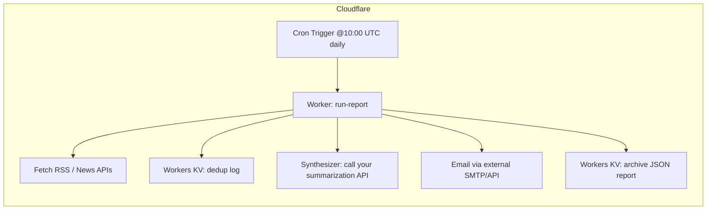

# Porto Tech News

A serverless news aggregator and summarizer focused on the Portuguese tech scene, particularly Porto's tech ecosystem. Built on Cloudflare Workers.

## Overview

This service fetches news from various RSS feeds, filters for recent and unseen articles, categorizes them, summarizes them using AI, and sends a daily email report.

The report includes:
- VC investments and funding rounds
- Market moves in the Portuguese tech scene
- Global tech news and trends
- Upcoming events (if available)

## Architecture



## Setup

### Prerequisites

- [Cloudflare Workers Account](https://workers.cloudflare.com/)
- [Wrangler CLI](https://developers.cloudflare.com/workers/wrangler/install-and-update/)
- Email provider account (SendGrid or Mailgun recommended)
- GPT4All or other language model API endpoint

### Installation

1. Clone this repository
2. Install dependencies:
   ```
   npm install
   ```
3. Configure your KV namespaces:
   ```
   wrangler kv:namespace create SEEN_ARTICLES
   wrangler kv:namespace create REPORTS
   ```
4. Update the KV namespace IDs in `wrangler.toml` with the ones you received from the commands above

### Configuration

Set the following secrets using Wrangler:

```bash
wrangler secret put EMAIL_API_KEY
wrangler secret put EMAIL_FROM
wrangler secret put EMAIL_TO
wrangler secret put GPT4ALL_ENDPOINT
wrangler secret put GPT4ALL_API_KEY
wrangler secret put FEED_LIST
```

- `EMAIL_API_KEY`: Your SendGrid or Mailgun API key
- `EMAIL_FROM`: Sender email address
- `EMAIL_TO`: Recipient email address
- `GPT4ALL_ENDPOINT`: URL to your language model API
- `GPT4ALL_API_KEY`: API key for your language model (if required)
- `FEED_LIST`: Comma-separated list of RSS feed URLs (optional)

### Deployment

Deploy to Cloudflare Workers:

```bash
npm run deploy
```

## Usage

The service runs automatically every day at 10:00 UTC (11:00 Europe/Lisbon) via Cloudflare's Cron Triggers.

You can also trigger it manually by sending a POST request to your Worker:

```
curl -X POST "https://porto-tech-news.<your-subdomain>.workers.dev/run-report"
```

## Customization

### Email Provider

By default, the service uses SendGrid for sending emails. To switch to Mailgun, modify the `EMAIL_PROVIDER` constant in `src/index.js`:

```javascript
const EMAIL_PROVIDER = 'mailgun';
```

For Mailgun, update the endpoint in the configuration with your domain:

```javascript
endpoint: 'https://api.mailgun.net/v3/YOUR_DOMAIN_NAME/messages',
```

### RSS Feeds

The default feeds can be customized by setting the `FEED_LIST` secret to a comma-separated list of RSS feed URLs.

## Development

Run the worker locally:

```bash
npm start
```

This will start a local development server where you can test the worker.

## License

ISC 